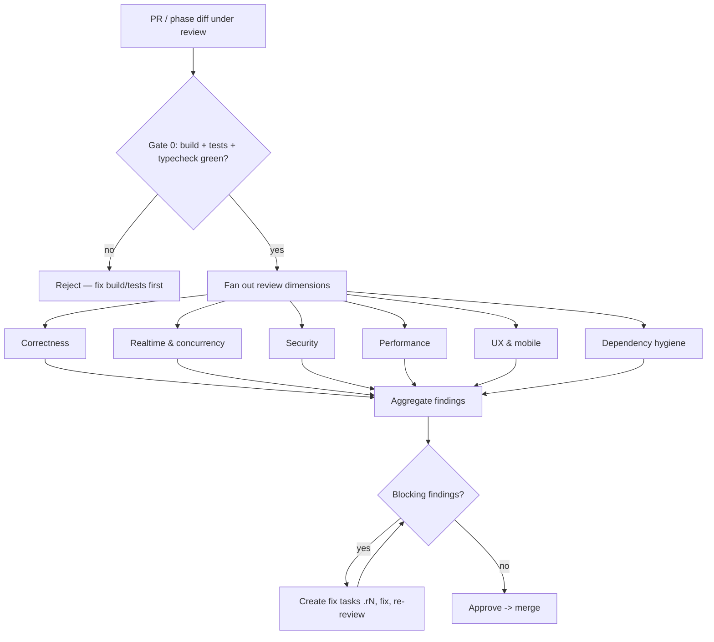
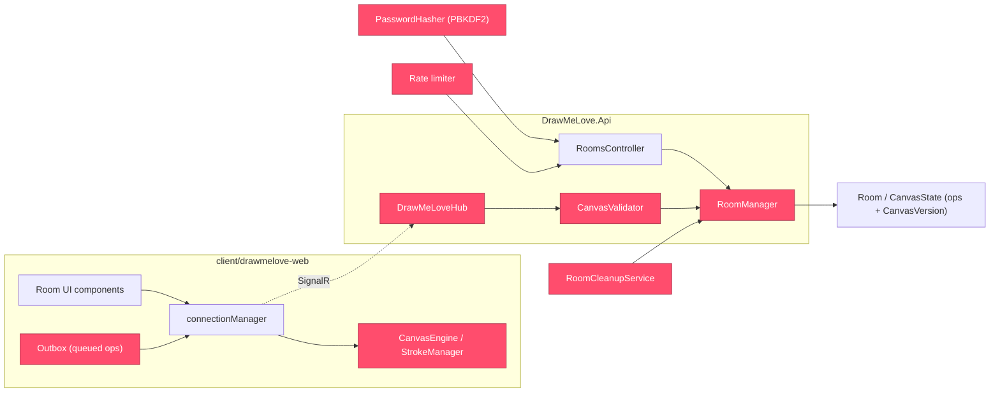

# DrawMeLove — Code Review Graph

How every change to DrawMeLove gets reviewed: a reviewer agent (or human) runs this pipeline on each PR and at every phase gate. Dimensions run in parallel; blockers stop the merge.

## Review pipeline



## Review hotspots



Hotspot reasons (red nodes — highest review attention):
- **DrawMeLoveHub** — every hub method must validate room access before touching the group.
- **CanvasValidator** — the only trust boundary for client ops; every field, every time.
- **RoomManager** — concurrency core; create/join/leave/destroy races live here.
- **RoomCleanupService** — must never destroy a room that is mid-join or non-empty.
- **PasswordHasher + Rate limiter** — 4-digit passwords are brute-forceable without them.
- **CanvasEngine / StrokeManager / Outbox** — local-first rendering, batching, and reconnect flush; bugs here break the core feel.

## Dimension checklists

| Dimension | Checks (every answer must be "yes") |
|---|---|
| Correctness | New logic covered by a test that fails without it? Op replay after snapshot identical to live rendering? Undo/redo/clear consistent on all clients after reconnect? Error paths (404/401/429, hub Error) handled, not swallowed? |
| Realtime & concurrency | Can DestroyRoom run while JoinRoom holds the room lock (must be impossible)? CanvasVersion monotonic and attached to every broadcast? Group membership granted only after access validation? Old-version reconnect triggers snapshot resync? Connection-to-room map cleaned up grace-aware on disconnect? |
| Security | Every client input validated server-side (ops, codes, passwords, sizes)? Join/password endpoints rate-limited per IP+room? Password stored hash-only, compared constant-time, never logged? Responses leak nothing (no stack traces, no oracle hints)? No room data ever sent outside its group? |
| Performance | Zero React re-renders during an active stroke? Stroke chunks batched (~50 ms) and under the 16 KB cap? Local draw path free of network calls and awaits? Snapshot-on-join sends ops once, no duplicates? |
| UX & mobile | Touch targets ≥ 44 px, nothing hover-only? Reconnecting and ended-room states render clearly, never a broken canvas? Overscroll / pull-to-refresh prevented on the canvas? Usable on a phone and desktop side by side? |
| Dependency hygiene | Every new dependency justified in the PR and inside the AGENTS.md allowlist? Nothing added that a platform built-in already covers? |

## Reviewer output

```text
Finding: <file>:<line>
Severity: blocker | advisory
Dimension: correctness | realtime | security | performance | ux-mobile | dependencies
Defect: <one sentence>
Scenario: <concrete input/state -> wrong behavior>
---
Verdict: approve | block
```

## When to run
- **Every PR** — advisory mode: findings posted on the PR; only blockers prevent merge.
- **Phase gate** (last task of a phase merged) — full mode over the whole phase diff (`git diff <previous-gate-sha>..HEAD`). Each blocker becomes a fix task (`<prefix><phase>.r1`, `.r2`, …) owned by the same role and merged before the next phase starts.
