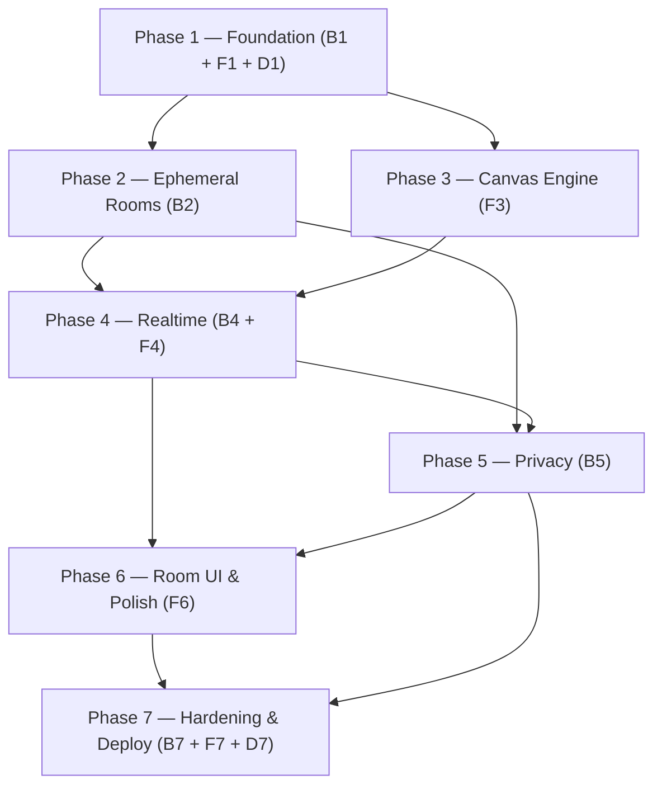

# DrawMeLove — Build Plan (Agent Work Order)

Status: ready for execution · 2026-09-23
Audience: autonomous coding agents executing one task at a time.

## Context
DrawMeLove is an ephemeral room-based realtime collaborative canvas: open → blank canvas + room code → draw → share link → draw together over SignalR → leave → room disappears. Stack: React + TypeScript + Vite frontend with a native-Canvas engine; ASP.NET Core 8 + SignalR backend; room and canvas state live only in memory; no database for MVP. `AGENTS.md` holds the product rules — read it before any task.

## How to execute (rules for every agent)
1. Pick the lowest-numbered unblocked task assigned to your role. A task is blocked until every task in its `Depends` list is merged to `main`.
2. One task = one branch `feature/<task-id>` = one PR. Never mix tasks.
3. The task text is the full requirement. If something is genuinely unspecified, follow `AGENTS.md`, choose the simplest option, and record the choice in your log.
4. Run the task's `Verify` commands; all must pass, and CI must be green, before you finish.
5. Append a work log `docs/logs/YYYY-MM-DD-<agent>-<task-id>.md` (task, decisions, output, verification, blockers; ≤ 40 lines).
6. No scope expansion, no extra dependencies, no drive-by refactors. If a task exceeds ~6 files, split it and note the split in the log and PR.
7. Phase gates: after the last task of a phase is merged, run the review pipeline in `docs/code-review-graph.md`. Blocking findings become new tasks (`<prefix><phase>.r1`, `.r2`, …) and must be fixed before the next phase starts.

## Agent team roster
| Role | Owns |
|---|---|
| backend | Solution, domain, rooms, SignalR hub, privacy, backend hardening (B tasks) |
| frontend | Vite app, canvas engine, realtime client, room UI, frontend hardening (F tasks) |
| devops | Dev environment, CI, deploy infra, project docs (D tasks) |
| reviewer | Phase-gate reviews per `docs/code-review-graph.md` |

## Phase map & dependency DAG
Phases 1–7. Backend and frontend phases interleave; parallel work is expected wherever the DAG allows.



Within phases, per-task dependencies are listed on each task (e.g. `F4.1` depends on `B4.1`). Phases 2 and 3 can run in parallel after Phase 1.

## Conventions
- Branches `feature/<task-id>`; conventional commits (`feat:`, `fix:`, `test:`, `chore:`).
- Backend: .NET 8 LTS, central package versions (`Directory.Packages.props`), nullable enabled, warnings as errors in CI.
- Frontend: TypeScript strict, deps pinned to react / react-dom / react-router-dom / @microsoft/signalr only.
- Environment: Node ≥ 20 (v24 present locally); .NET 8 SDK is NOT preinstalled — run `scripts/setup-dev.sh` (task D1.1) before any backend task.

---

## Phase 1 — Foundation (backend)

### B1.1 — Solution scaffold + build configuration
- **Role:** backend
- **Depends:** D1.1 (.NET SDK installed)
- **Files:** src/DrawMeLove.sln; src/DrawMeLove.Api/DrawMeLove.Api.csproj; src/DrawMeLove.Application/DrawMeLove.Application.csproj; src/DrawMeLove.Domain/DrawMeLove.Domain.csproj; src/DrawMeLove.Infrastructure/DrawMeLove.Infrastructure.csproj; tests/DrawMeLove.UnitTests/DrawMeLove.UnitTests.csproj; tests/DrawMeLove.IntegrationTests/DrawMeLove.IntegrationTests.csproj; Directory.Build.props; Directory.Packages.props; .editorconfig
- **Do:**
  - `dotnet new` solution + 4 projects (Api, Application, Domain, Infrastructure) + 2 xunit projects; references: Api→Application→Domain; Infrastructure→Application and →Domain; UnitTests→Application+Domain+Infrastructure; IntegrationTests→Api.
  - Directory.Build.props (repo root): TargetFramework net8.0, Nullable enable, ImplicitUsings enable, TreatWarningsAsErrors true, LangVersion latest.
  - Directory.Packages.props: ManagePackageVersionsCentrally=true; Microsoft.AspNetCore.SignalR.Client and Microsoft.AspNetCore.Mvc.Testing pinned to 8.0.*; xunit, xunit.runner.visualstudio, Microsoft.NET.Test.Sdk, coverlet.collector at current stable via `dotnet add package`; strip all Version= attributes from csproj files.
  - .editorconfig: 4-space indent, file-scoped namespaces, Roslyn defaults.
- **Accept when:** `dotnet build src/DrawMeLove.sln` succeeds with 0 warnings, 6 projects; no Version= attributes remain in any csproj.
- **Verify:** `dotnet build src/DrawMeLove.sln && grep -rn "Version=" --include=*.csproj src tests || echo CLEAN`

### B1.2 — Minimal runnable API + health endpoint
- **Role:** backend
- **Depends:** B1.1
- **Files:** src/DrawMeLove.Api/Program.cs; src/DrawMeLove.Api/Controllers/HealthController.cs; src/DrawMeLove.Api/appsettings.json; src/DrawMeLove.Api/appsettings.Production.json; src/DrawMeLove.Api/Properties/launchSettings.json
- **Do:**
  - Program.cs: AddControllers + AddSignalR (no MapHub yet); end with `public partial class Program {}` (required by WebApplicationFactory).
  - HealthController: GET /api/health → 200 {"status":"ok"}.
  - appsettings.json + appsettings.Production.json: Logging levels + AllowedHosts only.
- **Accept when:** both test projects pass; health route returns 200.
- **Verify:** `dotnet test`

### B1.3 — Core domain types + operation contract
- **Role:** backend
- **Depends:** B1.1
- **Files:** src/DrawMeLove.Application/Common/Result.cs; src/DrawMeLove.Domain/Enums/DrawingTool.cs; src/DrawMeLove.Domain/Enums/CanvasOperationType.cs; src/DrawMeLove.Domain/Entities/CanvasOperation.cs; tests/DrawMeLove.UnitTests/Domain/CanvasOperationTests.cs
- **Do:**
  - Result: `Result(bool Success, string? Error)` + `Result<T>` with Ok/Fail factories.
  - Enums: DrawingTool { Pencil, Brush, Eraser }; CanvasOperationType { Stroke, Text, Sticker, Erase, Undo, Redo, Clear }.
  - CanvasOperation record: CanvasOperationType Type; string Id; string OwnerId; string? TargetId; DrawingTool? Tool; string? Color; int? Size; int[][]? Points; string? Text; string? StickerId; double? X; double? Y — serialize camelCase + JsonStringEnumConverter. OwnerId = client-generated per-tab id (8–36 chars, [A-Za-z0-9-]); TargetId = referenced op id on undo/redo.
- **Accept when:** unit test round-trips the contract stroke JSON `{"type":"stroke","id":"st_123","ownerId":"client-a1b2c3","tool":"brush","color":"#ff4d6d","size":8,"points":[[120,200]]}` to an equal record.
- **Verify:** `dotnet test tests/DrawMeLove.UnitTests --filter CanvasOperation`


## Phase 1 — Foundation (frontend)

### F1.1 — Vite React-TS scaffold
- **Role:** frontend
- **Depends:** none
- **Files:** client/drawmelove-web/package.json; client/drawmelove-web/vite.config.ts; client/drawmelove-web/vitest.config.ts; client/drawmelove-web/tsconfig.json; client/drawmelove-web/eslint.config.js; client/drawmelove-web/index.html; client/drawmelove-web/src/main.tsx; client/drawmelove-web/src/styles/index.css
- **Do:** scaffold via `npm create vite@latest drawmelove-web -- --template react-ts` run from `client/`; merge create-vite's split tsconfigs into one tsconfig.json (strict, noUncheckedIndexedAccess, noFallthroughCasesInSwitch).
- **Do:** runtime deps exactly: react, react-dom, react-router-dom, @microsoft/signalr (dev: vite, typescript, eslint, vitest, @vitejs/plugin-react, typescript-eslint, react-hooks plugin); scripts: dev, build, preview, typecheck (`tsc --noEmit`), test (`vitest run`).
- **Do:** vitest.config.ts: environment node, include `src/**/*.test.ts`; minimal eslint flat config (js recommended + react-hooks); index.html: viewport-fit=cover, theme-color #FF4D6D, title DrawMeLove; replace template CSS with src/styles/index.css reset + custom props (--brand: #FF4D6D, spacing/radius scale); delete template demo assets (App.css, react.svg).
- **Accept when:** fresh `npm install` passes typecheck + build + test; no template demo content; no runtime dep outside the pinned four.
- **Verify:** `cd client/drawmelove-web && npm install && npm run typecheck && npm run build && npm run test`

### F1.2 — Typed contracts + fetch wrapper
- **Role:** frontend
- **Depends:** F1.1
- **Files:** client/drawmelove-web/src/types/room.ts; client/drawmelove-web/src/types/canvas.ts; client/drawmelove-web/src/types/realtime.ts; client/drawmelove-web/src/room/roomService.ts
- **Do:** types/room.ts: RoomInfo {exists, isPrivate, userCount}; RoomErrorCode = room_not_found | room_ended | wrong_password | rate_limited | invalid_operation; ApiError {status, code}.
- **Do:** types/canvas.ts: Operation discriminated union: stroke {id, ownerId, tool, color, size, points:[number,number][]}, erase {id, ownerId, tool:"eraser", size, points}, text {id, ownerId, text, x, y, color, size}, sticker {id, ownerId, stickerId, x, y, size}, undo/redo {id, ownerId, targetId}, clear {id, ownerId}.
- **Do:** types/realtime.ts: hub payloads OperationReceived(op, version), CanvasSnapshot(ops, version), UserJoined(userCount), UserLeft(userCount), RoomClosed(), HubError(code, message). NOTE: `ownerId` (per-tab id, sessionStorage) and `targetId` (undo/redo) are part of the canonical contract — defined in B1.3, validated in B4.2, ownership-enforced in B4.3.
- **Do:** roomService.ts: tiny fetch wrapper (no axios): apiGet/apiPost, JSON, throws ApiError; createRoom() → {code}; getRoom(code); joinRoom(code, password?) mapping 404/401/429 to typed errors; setPassword(code, password); base `import.meta.env.VITE_API_BASE ?? ""`.
- **Accept when:** zero `any`; every baseline contract field represented; 404/401/429 map to typed errors.
- **Verify:** `cd client/drawmelove-web && npm run typecheck`

### F1.3 — App shell, routing, room store
- **Role:** frontend
- **Depends:** F1.1, F1.2
- **Files:** client/drawmelove-web/src/App.tsx; client/drawmelove-web/src/pages/HomePage.tsx; client/drawmelove-web/src/pages/RoomPage.tsx; client/drawmelove-web/src/pages/NotFoundPage.tsx; client/drawmelove-web/src/components/Room/RoomCodeChip.tsx; client/drawmelove-web/src/room/roomStore.ts; client/drawmelove-web/src/hooks/useRoom.ts
- **Do:** routes: "/" → HomePage (roomService.createRoom() then replace-navigate to /r/{code}; "Preparing your canvas ❤️…" while pending), "/r/:code" → RoomPage, "*" → NotFoundPage ("This page wandered off ❤️" + home link).
- **Do:** layout: 100dvh flex column — header (brand "DrawMeLove" left, RoomCodeChip right), flex-1 canvas placeholder, bottom toolbar zone with env(safe-area-inset-bottom); overflow hidden, no page scroll at 360×640.
- **Do:** roomStore.ts: plain TS class (observable) + useRoom() via useSyncExternalStore; state {code, status: connecting | drawing | reconnecting | ended, isPrivate, userCount, version, error} + patch().
- **Accept when:** / navigates to a /r/{CODE} URL (createRoom may fail gracefully until B2.5 merges — show "Could not create room" state, retry button); 404 route renders; zero page scroll.
- **Verify:** `cd client/drawmelove-web && npm run typecheck && npm run build && npm run dev` (manual smoke)


## Phase 1 — Foundation (devops & CI)

### D1.1 — Dev environment bootstrap script
- **Role:** devops
- **Depends:** none
- **Files:** scripts/setup-dev.sh
- **Do:** Create an idempotent `set -euo pipefail` bash script that: (1) checks Node ≥ 20 via `node --version` (parse major, exit with clear message if missing/old) and prints npm version; (2) if `dotnet` is not already available with version 8.x, downloads https://dot.net/v1/dotnet-install.sh and installs the .NET 8 SDK (`--channel 8.0`) into `$HOME/.dotnet`; (3) appends `export DOTNET_ROOT="$HOME/.dotnet"` and `export PATH="$HOME/.dotnet:$PATH"` to `~/.bashrc` only if not already present; (4) verifies by running `$HOME/.dotnet/dotnet --version` and asserts it starts with `8.`.
- **Accept when:** running the script twice in a row succeeds; a fresh shell (after sourcing ~/.bashrc) has `dotnet --version` → 8.x; missing Node produces an actionable error.
- **Verify:** `bash scripts/setup-dev.sh && bash -n scripts/setup-dev.sh && dotnet --version` (local; requires internet, ~200 MB download).

### D1.2 — CI workflow
- **Role:** devops
- **Depends:** B1.1, F1.1
- **Files:** .github/workflows/ci.yml
- **Do:** GitHub Actions workflow, trigger on `pull_request` and `push` to `main`. Job `backend`: `actions/setup-dotnet@v4` with `dotnet-version: '8.0.x'`, then `dotnet restore src/DrawMeLove.sln`, `dotnet build src/DrawMeLove.sln --no-restore -warnaserror`, `dotnet test src/DrawMeLove.sln`. Job `frontend`: `actions/setup-node@v4` with `node-version: 24`, `working-directory: client/drawmelove-web`, then `npm ci`, `npm run typecheck`, `npm run build` (scripts `typecheck` and `build` are guaranteed by F1.1).
- **Accept when:** both jobs are green on a PR touching backend and frontend.
- **Verify:** `python3 -c "import yaml;yaml.safe_load(open('.github/workflows/ci.yml'))"` locally; actual green run visible in the GitHub Actions tab (needs GitHub).

### D1.3 — Pull request template
- **Role:** devops
- **Depends:** D1.2
- **Files:** .github/pull_request_template.md
- **Do:** Short template with sections: `What` (1-3 sentences), `Why` (task ID from plan.md, link task), `Verify` checklist (CI green; unit/integration tests pass; AGENTS.md rules respected — realtime path free of DB, no new deps without reason; agent log added under docs/logs/).
- **Accept when:** template auto-appears when opening a new PR on GitHub.
- **Verify:** `cat .github/pull_request_template.md` (content check local; appearance needs GitHub).


## Phase 2 — Ephemeral Rooms (backend)

### B2.1 — RoomCode value object + generator
- **Role:** backend
- **Depends:** B1.3
- **Files:** src/DrawMeLove.Domain/ValueObjects/RoomCode.cs; src/DrawMeLove.Application/Rooms/RoomCodeGenerator.cs; tests/DrawMeLove.UnitTests/Rooms/RoomCodeTests.cs; tests/DrawMeLove.UnitTests/Rooms/RoomCodeGeneratorTests.cs
- **Do:**
  - RoomCode: readonly record struct with factory Create(raw) → trim, ToUpperInvariant, validate `^[A-HJ-KM-NP-Z2-9]{4}$` → Result.
  - RoomCodeGenerator.GenerateUnique(Func<string,bool> isTaken): RandomNumberGenerator.GetInt32 over alphabet "ABCDEFGHJKMNPQRSTUVWXYZ23456789", 4 chars, retry while isTaken (max 50 attempts, then fail).
- **Accept when:** tests prove length 4; no I/L/O/0/1 in 20,000 samples; isTaken retry loop terminates on stub; invalid inputs rejected.
- **Verify:** `dotnet test tests/DrawMeLove.UnitTests --filter RoomCode`

### B2.2 — Room + CanvasState entities
- **Role:** backend
- **Depends:** B1.3
- **Files:** src/DrawMeLove.Domain/Entities/Room.cs; src/DrawMeLove.Domain/Entities/CanvasState.cs; tests/DrawMeLove.UnitTests/Domain/RoomTests.cs
- **Do:**
  - Room: RoomCode Code; string? PasswordHash; DateTimeOffset CreatedAt, LastActivity; HashSet<string> ConnectionIds; DateTimeOffset? EmptySince; CanvasState Canvas; object SyncRoot.
  - CanvasState: List<CanvasOperation> Ops; HashSet<string> UndoneOpIds; int Version.
  - Methods: AddConnection(connId, now) clears EmptySince + touches LastActivity; RemoveConnection(connId, now) sets EmptySince=now when zero remain; SnapshotOps() returns Ops excluding UndoneOpIds.
- **Accept when:** unit tests cover join/leave/EmptySince transitions and snapshot filtering with tombstones.
- **Verify:** `dotnet test tests/DrawMeLove.UnitTests --filter RoomTests`

### B2.3 — RoomManager (in-memory registry)
- **Role:** backend
- **Depends:** B2.1, B2.2
- **Files:** src/DrawMeLove.Application/Rooms/RoomManager.cs; tests/DrawMeLove.UnitTests/Rooms/RoomManagerTests.cs
- **Do:**
  - Sealed singleton: ConcurrentDictionary<string,Room> keyed by normalized code + ConcurrentDictionary<string,string> connectionId→code.
  - API: TryCreateRoom (generator collision retry, cap MaxRooms=500 → fail), Get(code), Join(code, connId, now) → bool, Leave(connId, now) → Room?, Destroy(code) → bool.
  - Destroy: under lock(room.SyncRoot) re-check ConnectionIds empty, fire `event Action<Room> RoomDestroyed`, then remove from dict (event-before-removal order is pinned — B4.4 depends on it).
  - All room state mutations happen inside lock(room.SyncRoot).
- **Accept when:** 200 parallel TryCreateRoom yield unique codes and cap holds; parallel join/leave keeps counts consistent; Destroy of non-empty room returns false; event fires exactly once.
- **Verify:** `dotnet test tests/DrawMeLove.UnitTests --filter RoomManager`

### B2.4 — Room cleanup service + clock
- **Role:** backend
- **Depends:** B2.3
- **Files:** src/DrawMeLove.Application/Rooms/RoomCleanupService.cs; src/DrawMeLove.Application/Rooms/RoomCleanupOptions.cs; src/DrawMeLove.Application/Common/ISystemClock.cs; src/DrawMeLove.Infrastructure/Services/SystemClock.cs; tests/DrawMeLove.UnitTests/Rooms/RoomCleanupServiceTests.cs; src/DrawMeLove.Api/Program.cs
- **Do:**
  - ISystemClock { DateTimeOffset UtcNow } in Application; SystemClock impl in Infrastructure.
  - RoomCleanupOptions { GracePeriodSeconds=45, CleanupIntervalSeconds=15 } bound from config section "Realtime".
  - BackgroundService loop with PeriodicTimer: destroy rooms where ConnectionIds.Count==0 && EmptySince + grace ≤ UtcNow via RoomManager.Destroy (its lock re-check makes the sweep race-safe against concurrent Join). Register hosted service + options in Program.cs.
- **Accept when:** FakeClock tests: empty for grace+1s → destroyed + event; rejoin at grace-1s → survives; occupied room never destroyed; concurrent Join during sweep never loses a room.
- **Verify:** `dotnet test tests/DrawMeLove.UnitTests --filter RoomCleanup`

### B2.5 — Rooms REST API
- **Role:** backend
- **Depends:** B2.4
- **Files:** src/DrawMeLove.Application/Rooms/RoomService.cs; src/DrawMeLove.Api/Controllers/RoomController.cs; src/DrawMeLove.Api/Contracts/RoomContracts.cs; tests/DrawMeLove.IntegrationTests/CustomWebApplicationFactory.cs; tests/DrawMeLove.IntegrationTests/Rooms/RoomEndpointsTests.cs
- **Do:**
  - RoomService facade: Create() → code; GetInfo(code) → (exists, isPrivate, userCount); Join(code, password?) → Result{userCount}: null PasswordHash ⇒ public ok; hash present ⇒ wrong_password for now (replaced by B5.3).
  - Controller: POST /api/rooms → 200 {code}; GET /api/rooms/{code} → 200 {exists,isPrivate,userCount} (always 200, even when missing); POST /api/rooms/{code}/join → 200 {code,userCount} / 401 {"error":"wrong_password"} / 404 {"error":"room_not_found"}.
  - REST join validates access only; it never creates a connection — connection counts live in the hub.
- **Accept when:** WebApplicationFactory tests: create→get exists=true userCount=0; get unknown exists=false; join unknown 404; 50 parallel joins+leaves through RoomManager end with correct userCount and no deadlock.
- **Verify:** `dotnet test tests/DrawMeLove.IntegrationTests --filter RoomEndpoints`


## Phase 3 — Canvas Engine (frontend)

### F3.1 — CanvasEngine core
- **Role:** frontend
- **Depends:** F1.3
- **Files:** client/drawmelove-web/src/canvas/CanvasEngine.ts; client/drawmelove-web/src/canvas/CanvasRenderer.ts
- **Do:** CanvasEngine owns two stacked canvases in a container div: committed layer + live-stroke layer (absolute, inset 0); both sized to container × devicePixelRatio; white background.
- **Do:** virtual space fixed 1000×750 (4:3), letterbox-fit: scale = min(w/1000, h/750), centered; expose getViewport() {scale, offsetX, offsetY, cssWidth, cssHeight}; ResizeObserver → recompute + invoke onResize callback (full replay re-render, wired in F3.5); destroy() detaches observer.
- **Do:** CanvasRenderer: shared stroke draw helpers (2d ctx, round caps/joins, quadratic midpoint smoothing).
- **Accept when:** both layers correct at DPR 1/2/3; 1000×750 area centered with letterbox; resize triggers callback with new viewport.
- **Verify:** `cd client/drawmelove-web && npm run typecheck && npm run build`

### F3.2 — Coordinate system
- **Role:** frontend
- **Depends:** F3.1
- **Files:** client/drawmelove-web/src/canvas/CoordinateSystem.ts; client/drawmelove-web/src/canvas/CoordinateSystem.test.ts
- **Do:** pure functions only (no DOM): toVirtual(viewport, clientX, clientY) → [x, y] clamped to 1000×750; toScreen inverse; dist(p1, p2).
- **Do:** thinPoints(points, minDistance=2): drop points closer than 2 virtual units to last kept point; always keep first and last.
- **Accept when:** toScreen(toVirtual(p)) round-trips within ±0.5; thinPoints keeps endpoints and respects threshold; file has zero window/document references.
- **Verify:** `cd client/drawmelove-web && npx vitest run src/canvas/CoordinateSystem.test.ts`

### F3.3 — StrokeManager
- **Role:** frontend
- **Depends:** F3.1, F3.2
- **Files:** client/drawmelove-web/src/canvas/StrokeManager.ts; client/drawmelove-web/src/canvas/StrokeManager.test.ts
- **Do:** listens on live layer: pointerdown → setPointerCapture and reject further pointers while one is active (single active pointer); pointermove → toVirtual + thinPoints; rAF loop renders partial stroke to live layer.
- **Do:** batching: buffer points; emit chunk via onChunk(op-part) at ≥50 ms or ≥16 points (whichever first); pointerup → onCommit(full op) and clear live layer. Chunks carry the same op id; commit carries full point list.
- **Do:** emitters receive ops with current tool/color/size injected from a config getter (wired to toolStore in F3.7).
- **Accept when:** 100 synthetic pointer events → rAF-throttled renders; no chunk exceeds 16 points; exactly one commit with full points; a second simultaneous pointer is ignored.
- **Verify:** `cd client/drawmelove-web && npx vitest run src/canvas/StrokeManager.test.ts`

### F3.4 — Tools: pencil, brush, eraser
- **Role:** frontend
- **Depends:** F3.3
- **Files:** client/drawmelove-web/src/canvas/tools/PencilTool.ts; client/drawmelove-web/src/canvas/tools/BrushTool.ts; client/drawmelove-web/src/canvas/tools/EraserTool.ts; client/drawmelove-web/src/canvas/tools/index.ts
- **Do:** tools/index.ts registry: {id: "pencil" | "brush" | "eraser", render(ctx, op)}; shared stroke path via CanvasRenderer with round caps/joins and quadratic midpoint smoothing.
- **Do:** pencil renders at size × 0.5, brush at size, both source-over; eraser renders at size × 2 with globalCompositeOperation destination-out on the committed layer (strict op order keeps replay deterministic).
- **Do:** applyOp(layerCtx, op) dispatches through the registry; sizes come from active preset (2/6/14 virtual units).
- **Accept when:** registry dispatch works for all three ids; eraser uses destination-out; geometry-level tests only (no pixel assertions — jsdom canvas limits).
- **Verify:** `cd client/drawmelove-web && npm run typecheck && npm run test`

### F3.5 — OpLog: undo/redo + replay
- **Role:** frontend
- **Depends:** F3.4
- **Files:** client/drawmelove-web/src/canvas/OpLog.ts; client/drawmelove-web/src/canvas/OpLog.test.ts
- **Do:** OpLog: ordered op list + tombstone set by op id; myOwnerId set at construction (per-tab id from sessionStorage — identity only, never canvas content); undo() tombstones my latest non-tombstoned op; redo() un-tombstones my last undone; undo/redo ops emit {type, id, ownerId, targetId}.
- **Do:** replay(render fn): clear committed layer, apply non-tombstoned ops in strict original order via the tool registry (deterministic, eraser-safe); clear op empties the log entirely (version preserved).
- **Do:** engine gains: applyOp(op), setOps(ops) (snapshot), undo(), redo(), canUndo/canRedo (computed from my ops only).
- **Accept when:** tests prove: I cannot undo a foreign-owner op; tombstoned ops are excluded from replay; undo-after-eraser restores erased content; clear wipes everything; replay order is stable across runs.
- **Verify:** `cd client/drawmelove-web && npx vitest run src/canvas/OpLog.test.ts`

### F3.6 — Toolbar UI
- **Role:** frontend
- **Depends:** F3.5
- **Files:** client/drawmelove-web/src/components/Canvas/CanvasToolbar.tsx; client/drawmelove-web/src/components/Canvas/ColorPalette.tsx; client/drawmelove-web/src/components/Canvas/SizePicker.tsx; client/drawmelove-web/src/state/toolStore.ts
- **Do:** toolStore (same observable pattern as roomStore): {tool, color, size} + setters; subscribe via useSyncExternalStore.
- **Do:** bottom bar buttons: ✏️ pencil, 🖌 brush, 🧽 eraser, 🎨 palette popup, 😊 sticker (disabled placeholder until F6.5), T text (placeholder until F6.4), ↶ undo, ↷ redo (disabled until canUndo/canRedo); all targets ≥44×44 px, aria-label + aria-pressed.
- **Do:** palette: 8 colors #FF4D6D #FF8FA3 #FFB627 #6BCB77 #4D96FF #6C5CE7 #A29BFE #2D3436; sizes S/M/L = 2/6/14 virtual units; popup closes on outside tap; active selections highlighted.
- **Accept when:** selections persist in toolStore; undo/redo reflect engine state; no layout shift when popup opens.
- **Verify:** `cd client/drawmelove-web && npm run typecheck && npm run build`

### F3.7 — DrawingCanvas wiring
- **Role:** frontend
- **Depends:** F3.6
- **Files:** client/drawmelove-web/src/components/Canvas/DrawingCanvas.tsx; client/drawmelove-web/src/hooks/useCanvas.ts
- **Do:** useEffect (mount-once, empty deps) constructs the single CanvasEngine in a container ref; wires StrokeManager with a config getter reading toolStore; tool/color/size changes flow engine-side, never as React props/state.
- **Do:** expose the engine instance via useCanvas() context/module-singleton accessor for F4.x (no window globals).
- **Do:** verify zero RoomPage re-renders during a full stroke (React Profiler); document the check in the PR.
- **Accept when:** pencil/brush/eraser draw with mouse, touch, and pen; switching tool/color/size mid-session applies to the next stroke; no React re-render per pointer event.
- **Verify:** `cd client/drawmelove-web && npm run typecheck && npm run build && npm run dev` (manual stroke + profiler check)


## Phase 4 — Realtime (backend)

### B4.1 — DrawMeLoveHub: join, leave, presence, snapshot
- **Role:** backend
- **Depends:** B2.5
- **Files:** src/DrawMeLove.Api/Hubs/DrawMeLoveHub.cs; src/DrawMeLove.Application/Realtime/RealtimeConnectionRegistry.cs; src/DrawMeLove.Api/Program.cs; tests/DrawMeLove.UnitTests/Realtime/RealtimeConnectionRegistryTests.cs
- **Do:**
  - MapHub<DrawMeLoveHub>("/hubs/draw"). JoinRoom(code, password?): missing room → HubException("room_not_found"); PasswordHash present ⇒ HubException("wrong_password") until B5.3; success: RoomManager.Join + Groups.AddToGroupAsync(connId, "room:{CODE}") + OthersInGroup UserJoined(userCount) + Caller gets UserJoined(userCount) then CanvasSnapshot(SnapshotOps(), Version).
  - LeaveRoom and OnDisconnectedAsync: registry remove, RoomManager.Leave, OthersInGroup UserLeft(userCount); empty room only sets EmptySince (grace, silent).
  - Invoke failures throw HubException(message = error code); the Error(code,message) client callback is reserved for async pushes (used by B4.4).
- **Accept when:** registry unit tests pass; hub compiles with rooms lifecycle.
- **Verify:** `dotnet test tests/DrawMeLove.UnitTests --filter RealtimeConnectionRegistry`

### B4.2 — CanvasValidator + sticker catalog
- **Role:** backend
- **Depends:** B1.3
- **Files:** src/DrawMeLove.Application/Canvas/CanvasValidator.cs; src/DrawMeLove.Application/Canvas/StickerCatalog.cs; tests/DrawMeLove.UnitTests/Canvas/CanvasValidatorTests.cs
- **Do:**
  - Validate(op) → Result: stroke/erase need Tool + Color matching `^#([0-9a-fA-F]{3}|[0-9a-fA-F]{6})$` + Size 1–64 + Points 1..512 entries with both coords 0–4096; text needs Text 1–120 chars + X/Y in 0–4096; sticker needs StickerId in catalog.
  - OwnerId required on every op, format `^[A-Za-z0-9-]{8,36}$`; TargetId required on undo/redo, same format; violations → invalid_operation.
  - StickerCatalog.Allowed = the 24 canonical emoji ids shared with the frontend picker (❤️ 🧡 💛 💚 💙 💜 🖤 💕 💖 💘 💝 🌹 🌸 🌺 😊 😍 🥰 😘 🤗 ✨ 🎉 🎁 🐻 ⭐); stickerId = the emoji character itself. Single source of truth; F6.5 reuses it.
  - Whole-message guard: JSON-serialized op ≤ 16 KB.
- **Accept when:** tests: valid stroke passes; 513 points, coord 4097, size 0, size 65, bad color, 121-char text, unknown sticker, 17 KB op each fail with distinct errors.
- **Verify:** `dotnet test tests/DrawMeLove.UnitTests --filter CanvasValidator`

### B4.3 — Canvas apply pipeline (server authority)
- **Role:** backend
- **Depends:** B4.2
- **Files:** src/DrawMeLove.Application/Canvas/CanvasService.cs; tests/DrawMeLove.UnitTests/Canvas/CanvasServiceTests.cs; src/DrawMeLove.Api/Hubs/DrawMeLoveHub.cs
- **Do:**
  - Apply(room, op, now) inside lock(room.SyncRoot): Validate, then stroke/text/sticker/erase append to Ops; undo: target must exist in Ops, not be undone, AND target.OwnerId == op.OwnerId → add to UndoneOpIds; redo: target in UndoneOpIds AND target.OwnerId == op.OwnerId → remove; clear: Ops=[clear op] + UndoneOpIds.Clear(); then Canvas.Version++, LastActivity=now. Any violation → invalid_operation (unknown or foreign-owner undo/redo target included).
  - Hub SendOperation(op): success → Clients.OthersInGroup OperationReceived(op, version) — sender gets NO echo (it rendered locally); failure → HubException("invalid_operation"), version unchanged.
- **Accept when:** tests: undo/redo/clear semantics incl. snapshot excludes undone and clear resets tombstones; 100 threads calling Apply produce versions exactly 1..100.
- **Verify:** `dotnet test tests/DrawMeLove.UnitTests --filter CanvasService`

### B4.4 — Reconnect resync + RoomClosed broadcast
- **Role:** backend
- **Depends:** B4.1, B4.3
- **Files:** src/DrawMeLove.Api/Hubs/DrawMeLoveHub.cs; src/DrawMeLove.Api/Program.cs; src/DrawMeLove.Application/Rooms/RoomManager.cs
- **Do:**
  - JoinRoom gains optional int lastVersion = -1: after join, skip snapshot when lastVersion == Canvas.Version; send snapshot when lastVersion < Version OR lastVersion > Version (client ahead = desync). Auto-reconnect yields a fresh connectionId, so clients re-invoke JoinRoom with their lastVersion.
  - Program.cs: subscribe RoomManager.RoomDestroyed → IHubContext broadcast RoomClosed() then Error("room_ended","This room has ended") to "room:{CODE}"; RoomManager fires the event before dictionary removal (pinned in B2.3) so the group still exists.
- **Accept when:** RoomManager test proves event-before-removal ordering; solution builds clean.
- **Verify:** `dotnet build src/DrawMeLove.sln && dotnet test tests/DrawMeLove.UnitTests --filter RoomManager`

### B4.5 — Realtime integration suite
- **Role:** backend
- **Depends:** B4.4
- **Files:** tests/DrawMeLove.IntegrationTests/Realtime/DrawMeLoveHubTests.cs
- **Do:**
  - Microsoft.AspNetCore.SignalR.Client HubConnection over WebApplicationFactory.
  - Scenarios: (1) join unknown code → HubException room_not_found; (2) A joins → snapshot v0; B joins → both get UserJoined(2); (3) A stroke → B OperationReceived v1 while A receives nothing; (4) B sends 513-point op → HubException invalid_operation, version stays 1; (5) B reconnects with lastVersion 0 → snapshot with 1 op; (6) Realtime:GracePeriodSeconds=1 + CleanupIntervalSeconds=1 → both disconnect → RoomClosed observed within 6s; (7) two clients, 50 parallel sends → receiver sees versions 1..50 with no gaps or dups.
- **Accept when:** all 7 scenarios pass in one run.
- **Verify:** `dotnet test tests/DrawMeLove.IntegrationTests --filter DrawMeLoveHubTests`

### B4.6 — Realtime protocol documentation
- **Role:** backend
- **Depends:** B4.5
- **Files:** docs/realtime-protocol.md
- **Do:**
  - Single source of truth doc: REST table (paths, bodies, status codes incl. later 409 room_not_lockable and 429 rate_limited); hub invoke methods + client callbacks (OperationReceived, CanvasSnapshot, UserJoined, UserLeft, RoomClosed, Error) with payloads; HubException-on-invoke vs Error-push rule; op schema + validation caps table; version/snapshot/reconnect semantics incl. sender-no-echo; sticker whitelist; camelCase + string enums.
- **Accept when:** every method name in the doc exists in DrawMeLoveHub.cs; doc ≤ 200 lines.
- **Verify:** `grep -c "OperationReceived" docs/realtime-protocol.md`


## Phase 4 — Realtime (frontend)

### F4.1 — SignalR connection manager
- **Role:** frontend
- **Depends:** B4.1, F1.2
- **Files:** client/drawmelove-web/src/realtime/signalRClient.ts; client/drawmelove-web/src/realtime/connectionManager.ts; client/drawmelove-web/src/realtime/realtimeEvents.ts; client/drawmelove-web/src/hooks/useSignalR.ts
- **Do:** HubConnectionBuilder with withUrl(`${VITE_API_BASE}/hubs/draw`), withAutomaticReconnect([0, 2000, 5000, 10000]), serverTimeout 30 s; before connecting ensure access via roomService.joinRoom(code, password) — on 401 render an inline 4-digit password prompt (kept in memory only); after (re)connect invoke JoinRoom(code, password, lastVersion = roomStore.version) so the server can skip or send a fresh snapshot (B4.4).
- **Do:** realtimeEvents.ts: typed emitter mapping S→C payloads (OperationReceived, CanvasSnapshot, UserJoined, UserLeft, RoomClosed, HubError) to subscribers; connectionManager exposes status events connecting → connected → reconnecting → ended and RoomClosed handling.
- **Do:** useSignalR(code): joins on mount, stop() + cleanup on unmount; re-join after reconnect triggers fresh CanvasSnapshot resync (server-driven).
- **Accept when:** status transitions emit as typed events; reconnect loop retries indefinitely and re-joins; zero `any`.
- **Verify:** `cd client/drawmelove-web && npm run typecheck && npm run build`

### F4.2 — Outbox: local-first send
- **Role:** frontend
- **Depends:** F4.1, F3.3
- **Files:** client/drawmelove-web/src/realtime/outbox.ts; client/drawmelove-web/src/realtime/outbox.test.ts
- **Do:** local render always happens first (StrokeManager already renders); outbox.send(op) invokes SendOperation(op) when connected, else queues.
- **Do:** flush() on reconnect sends queued ops in order (chunks before commits; preserve emission order); dedupe by op id + chunk index; on send failure re-queue and keep flushing on next reconnect; queue cap 200 — drop oldest stroke chunks, never text/sticker/clear ops.
- **Accept when:** tests prove in-order flush after reconnect, dedupe of a re-emitted chunk, and cap enforcement that protects text/sticker ops.
- **Verify:** `cd client/drawmelove-web && npx vitest run src/realtime/outbox.test.ts`

### F4.3 — Inbound rendering + presence
- **Role:** frontend
- **Depends:** F4.2, F3.5
- **Files:** client/drawmelove-web/src/pages/RoomPage.tsx; client/drawmelove-web/src/components/Canvas/DrawingCanvas.tsx; client/drawmelove-web/src/room/roomStore.ts
- **Do:** OperationReceived(op, version) → engine.applyOp (engine skips ops whose ownerId === myOwnerId); CanvasSnapshot(ops, version) → engine.setOps + replay + roomStore.version = version; roomStore.version tracks every version bump.
- **Do:** UserJoined/UserLeft → roomStore.userCount (header shows "2 ❤️"-style count); RoomClosed → status "ended" (placeholder screen now, full screen in F6.6); HubError → roomStore.error (toast hook point).
- **Do:** reconnecting status renders a fixed top banner "Reconnecting… ❤️" driven by roomStore.status.
- **Accept when:** manual two-tab test: strokes appear on the peer within ~100 ms; late joiner receives snapshot and renders existing drawing; presence updates both directions; ended placeholder shows.
- **Verify:** `cd client/drawmelove-web && npm run typecheck && npm run build` + manual two-tab check (steps documented in PR)

### F4.4 — Undo/redo/clear over the wire
- **Role:** frontend
- **Depends:** F4.3
- **Files:** client/drawmelove-web/src/components/Canvas/CanvasToolbar.tsx; client/drawmelove-web/src/components/Canvas/DrawingCanvas.tsx
- **Do:** toolbar ↶/↷ call engine.undo()/redo() locally AND outbox.send({type:"undo"|"redo", id, ownerId, targetId}); remote engines tombstone/un-tombstone targetId only when targetId's ownerId === sender's ownerId (peer-auth enforced server-side in B4.x).
- **Do:** clear: confirm() dialog → outbox.send({type:"clear"}) → engine clears log; remote engines clear on receipt.
- **Accept when:** two-tab manual test: A undo removes A's stroke on B; A cannot remove B's stroke; clear wipes both tabs only after confirm.
- **Verify:** `cd client/drawmelove-web && npm run typecheck` + manual two-tab test


## Phase 5 — Privacy (backend)

### B5.1 — PBKDF2 password hasher
- **Role:** backend
- **Depends:** B1.3
- **Files:** src/DrawMeLove.Application/Authentication/IPasswordHasher.cs; src/DrawMeLove.Infrastructure/Security/PasswordHasher.cs; tests/DrawMeLove.UnitTests/Authentication/PasswordHasherTests.cs
- **Do:**
  - IPasswordHasher { string Hash(string password); bool Verify(string hash, string password); }.
  - Impl: Rfc2898DeriveBytes.Pbkdf2 with 16-byte random salt, 210,000 iterations, HashAlgorithmName.SHA256, 32-byte subkey; format "pbkdf2-sha256$210000$<salt-b64>$<hash-b64>"; Verify parses, re-derives, compares with CryptographicOperations.FixedTimeEquals; malformed hash ⇒ false, never throws. Register in DI.
- **Accept when:** tests: verify true; wrong password false; same password hashed twice differs; empty/malformed hash returns false.
- **Verify:** `dotnet test tests/DrawMeLove.UnitTests --filter PasswordHasher`

### B5.2 — Set room password endpoint
- **Role:** backend
- **Depends:** B5.1, B2.5
- **Files:** src/DrawMeLove.Application/Rooms/RoomService.cs; src/DrawMeLove.Api/Controllers/RoomController.cs; tests/DrawMeLove.IntegrationTests/Rooms/PasswordEndpointTests.cs
- **Do:**
  - RoomService.SetPassword(code, password): unknown code → 404 room_not_found; must match `^[0-9]{4}$` else 400 invalid_password; allowed only while userCount ≤ 1 else 409 room_not_lockable (creator locks before sharing); store hasher output, touch LastActivity.
  - Controller: POST /api/rooms/{code}/password {password} → 200 {isPrivate:true} or mapped error JSON. No unlock/remove-password endpoint in MVP.
- **Accept when:** tests: ok path; bad format 400; room with a second fake connection via RoomManager → 409; unknown 404; GET then shows isPrivate=true.
- **Verify:** `dotnet test tests/DrawMeLove.IntegrationTests --filter PasswordEndpoint`

### B5.3 — Private-room join authentication
- **Role:** backend
- **Depends:** B5.2
- **Files:** src/DrawMeLove.Application/Rooms/RoomService.cs; src/DrawMeLove.Api/Hubs/DrawMeLoveHub.cs; tests/DrawMeLove.IntegrationTests/Rooms/JoinAuthTests.cs
- **Do:**
  - Replace the B4.1 placeholder: room with PasswordHash requires the password argument; REST Join: null/empty/wrong ⇒ 401 {"error":"wrong_password"} with byte-identical body for missing vs wrong (no oracle); hub JoinRoom ⇒ HubException("wrong_password"). Public rooms ignore a supplied password.
- **Accept when:** tests: private join without password 401/HubException; wrong 401; correct 200 on both paths; public room with stray password still joins.
- **Verify:** `dotnet test tests/DrawMeLove.IntegrationTests --filter JoinAuth`

### B5.4 — Rate limiting (join + password endpoints)
- **Role:** backend
- **Depends:** B5.2
- **Files:** src/DrawMeLove.Api/Program.cs; src/DrawMeLove.Application/Authentication/JoinAttemptTracker.cs; tests/DrawMeLove.UnitTests/Authentication/JoinAttemptTrackerTests.cs; tests/DrawMeLove.IntegrationTests/Privacy/RateLimitTests.cs; src/DrawMeLove.Api/appsettings.json
- **Do:**
  - Program.cs AddRateLimiter: policy "join" = FixedWindow PermitLimit 10 / Window 60s partitioned "{ip}:{code}"; policy "global-ip" = 120/min; OnRejected writes 429 {"error":"rate_limited"}; attach to join + password endpoints. Config keys RateLimiting:Join:PermitLimit, Join:WindowSeconds, Global:PermitLimit.
  - Hub path has no HTTP pipeline: JoinAttemptTracker (ConcurrentDictionary<string,(DateTimeOffset windowStart,int count)>, same 10/60s per ip+code) checked first in hub JoinRoom → HubException("rate_limited"); IP from IHttpContextAccessor (register it).
- **Accept when:** tracker unit tests prove window reset and per-key isolation; integration test gets 429 on the 11th REST join attempt.
- **Verify:** `dotnet test tests/DrawMeLove.IntegrationTests --filter RateLimit`

### B5.5 — Privacy end-to-end suite
- **Role:** backend
- **Depends:** B5.3, B5.4
- **Files:** tests/DrawMeLove.IntegrationTests/Privacy/PrivacyFlowTests.cs
- **Do:**
  - One factory, independent rooms per test: create → set password → REST join correct 200 → hub join correct ok → REST wrong 401 → hub wrong HubException → 10 rapid wrong attempts → next attempt 429 / HubException rate_limited → a different room is NOT limited (proves per-room partition).
- **Accept when:** suite green in a single run.
- **Verify:** `dotnet test tests/DrawMeLove.IntegrationTests --filter PrivacyFlow`


## Phase 6 — Room UI & Emotional Polish (frontend)

### F6.1 — Toasts + room chip + copy link
- **Role:** frontend
- **Depends:** F1.3
- **Files:** client/drawmelove-web/src/components/Common/Toast.tsx; client/drawmelove-web/src/components/Common/toastStore.ts; client/drawmelove-web/src/components/Room/RoomCodeChip.tsx
- **Do:** toastStore.show(message, {emoji, duration=2500}) + Toast renderer: stacked pills bottom-center above toolbar, CSS fade/slide, aria-live="polite", max 3 visible.
- **Do:** RoomCodeChip: code in mono pill (header); copy icon → navigator.clipboard.writeText(`${location.origin}/r/${code}`) → toast "Link copied ❤️"; clipboard failure → toast "Copy failed — long-press the code".
- **Do:** separate share icon renders only when navigator.share exists → navigator.share({title: "DrawMeLove", url}).
- **Accept when:** copy writes the full room URL; toasts auto-dismiss and stack; share button hidden where unsupported.
- **Verify:** `cd client/drawmelove-web && npm run typecheck && npm run build` (manual clipboard check)

### F6.2 — JoinModal
- **Role:** frontend
- **Depends:** B2.5, F1.2, F6.1
- **Files:** client/drawmelove-web/src/components/Room/JoinModal.tsx; client/drawmelove-web/src/components/Room/JoinButton.tsx; client/drawmelove-web/src/components/Common/BottomSheet.tsx
- **Do:** Join button in header (hidden while already in a room); BottomSheet: slides up on mobile, centered dialog ≥640 px viewport, focus trap, Esc + backdrop close, aria-modal.
- **Do:** fields: room code (auto-uppercase, maxLength 4, autocomplete off) + optional 4-digit password (type password, inputMode numeric); submit disabled while pending.
- **Do:** flow: roomService.joinRoom() first → 404 "Room not found", 401 "Incorrect password", 429 "Too many attempts — wait a minute ❤️"; success → navigate(`/r/${CODE}`) which then connects via F4.1.
- **Accept when:** every error state renders its message inline; success navigates; sheet is keyboard- and screen-reader-usable.
- **Verify:** `cd client/drawmelove-web && npm run typecheck && npm run build`

### F6.3 — Privacy sheet
- **Role:** frontend
- **Depends:** B5.2, F6.1
- **Files:** client/drawmelove-web/src/components/Room/PrivacyButton.tsx; client/drawmelove-web/src/components/Room/PrivacySheet.tsx
- **Do:** header lock button: 🔓 when public, 🔒 once private. Sheet: Public/Private radio; choosing private reveals 4 single-digit boxes with auto-advance, paste support, backspace move-back.
- **Do:** Save → roomService.setPassword(code, digits) once → toast "Room locked 🔒"; roomStore.isPrivate = true; password never displayed or stored after save (MVP: re-entering the sheet allows overwrite).
- **Accept when:** 4-box input handles typing, paste, and backspace correctly; exactly one POST per save; header icon reflects state.
- **Verify:** `cd client/drawmelove-web && npm run typecheck && npm run build`

### F6.4 — Text tool
- **Role:** frontend
- **Depends:** F3.7, F4.4
- **Files:** client/drawmelove-web/src/canvas/tools/TextTool.ts; client/drawmelove-web/src/components/Canvas/TextInputOverlay.tsx
- **Do:** toolbar T enables text mode; tap on canvas → floating input positioned at tap point; Enter/blur commits op {type:"text", text, x, y, color, size} via outbox; Esc cancels; maxLength 60.
- **Do:** TextTool.render: ctx.fillText with font size S/M/L = 24/48/96 virtual units, current color, system-ui; replay renders identically at any viewport size (virtual coords).
- **Accept when:** committed text appears at the correct virtual position and survives resize/replay; commit and cancel both work.
- **Verify:** `cd client/drawmelove-web && npm run typecheck` + manual test

### F6.5 — Sticker tool
- **Role:** frontend
- **Depends:** F3.7, F4.4
- **Files:** client/drawmelove-web/src/canvas/tools/StickerTool.ts; client/drawmelove-web/src/components/Stickers/StickerPicker.tsx
- **Do:** 😊 button opens picker grid of the 24 canonical emojis from B4.2's StickerCatalog (love/hearts/faces/nature: ❤️🧡💛💚💙💜🖤💕💖💘💝🌹🌸🌺😊😍🥰😘🤗✨🎉🎁🐻⭐); stickerId = the emoji character itself, exported as STICKERS and validated against the same server-side catalog.
- **Do:** pick sticker → next canvas tap places op {type:"sticker", stickerId, x, y, size}; StickerTool.render: ctx.font text, sizes S/M/L = 48/96/160 virtual units, textAlign center, textBaseline middle.
- **Do:** picker closes after selection; 😊 button no longer disabled (remove F3.6 placeholder).
- **Accept when:** sticker renders centered at tap; survives replay + resize; picker selection flow is one tap + one tap.
- **Verify:** `cd client/drawmelove-web && npm run typecheck` + manual test

### F6.6 — Ended-room screen
- **Role:** frontend
- **Depends:** F4.3
- **Files:** client/drawmelove-web/src/pages/RoomEndedPage.tsx
- **Do:** replaces the F4.3 placeholder: centered card "This room has ended." + "Every drawing lives only in the moment ❤️" + button "Create a new room" → roomService.createRoom() → navigate /r/{newCode}; toolbar hidden in ended state.
- **Do:** direct visit to a dead /r/{code}: getRoom() returns {exists:false} (B2.5 always answers 200) → same page with variant text "This room no longer exists."
- **Accept when:** RoomClosed leads to the ended screen; dead-link visit shows the not-found variant; create-new-room round-trips into a fresh room.
- **Verify:** `cd client/drawmelove-web && npm run typecheck && npm run build` + manual test

### F6.7 — Mobile polish + micro-interactions
- **Role:** frontend
- **Depends:** F6.6
- **Files:** client/drawmelove-web/src/styles/index.css
- **Do:** canvas touch-action: none; body overscroll-behavior: none (no pull-to-refresh); toolbar buttons touch-action: manipulation (no double-tap zoom); safe-area padding on header + toolbar; audit listeners → passive where scroll-related.
- **Do:** CSS-only micro-interactions: tool-select bounce (scale keyframe), pulse on presence count change, button press states; all gated behind prefers-reduced-motion.
- **Do:** landscape: toolbar stays bottom, canvas letterboxes (already virtual-space safe); verify on 360×640 and 844×390.
- **Accept when:** on a real phone: no scroll/zoom/pull-to-refresh during drawing; all targets ≥44 px; animations disabled under reduced motion.
- **Verify:** `cd client/drawmelove-web && npm run build` + manual device test (device + result noted in PR)

### F6.8 — Frontend logic test suite
- **Role:** frontend
- **Depends:** F3.2, F3.3, F3.5, F4.2
- **Files:** client/drawmelove-web/src/room/roomStore.test.ts; client/drawmelove-web/src/room/roomService.test.ts
- **Do:** consolidate the suite to ≤ 8 focused test blocks across existing test files (coordinate round-trip, thinPoints, chunk batching, OpLog ownership + replay determinism, outbox order + dedupe) plus two new: roomStore transitions connecting→drawing→reconnecting→ended; ApiError → message mapping for 404/401/429.
- **Do:** pure logic only — no DOM/canvas pixel assertions; suite runs < 5 s.
- **Accept when:** `npm run test` green with ≤ 8 blocks total across the repo.
- **Verify:** `cd client/drawmelove-web && npx vitest run`


## Phase 7 — Production Hardening (backend)

### B7.1 — Global exception middleware
- **Role:** backend
- **Depends:** B2.5
- **Files:** src/DrawMeLove.Api/Middleware/ExceptionMiddleware.cs; src/DrawMeLove.Api/Program.cs; tests/DrawMeLove.UnitTests/Middleware/ExceptionMiddlewareTests.cs
- **Do:**
  - First middleware: catch Exception → log with traceId Guid.NewGuid(), respond 500 {"error":"internal_error","traceId":"..."} — never stack traces or exception text. Unmatched /api/* route → 404 {"error":"not_found"}. Register before rate limiting and controllers.
- **Accept when:** unit test with DefaultHttpContext: throwing next → 500 JSON containing traceId and no exception text.
- **Verify:** `dotnet test tests/DrawMeLove.UnitTests --filter ExceptionMiddleware`

### B7.2 — Structured logging conventions
- **Role:** backend
- **Depends:** B4.4
- **Files:** src/DrawMeLove.Application/Rooms/RoomManager.cs; src/DrawMeLove.Application/Rooms/RoomCleanupService.cs; src/DrawMeLove.Api/Hubs/DrawMeLoveHub.cs; src/DrawMeLove.Application/Canvas/CanvasValidator.cs
- **Do:**
  - Add ILogger (constructor-injected only) structured events: room_created{code}, room_destroyed{code}, room_expired{code}, user_joined{code,userCount}, user_left{code,userCount}, join_failed{code,reason}, auth_failed{code}, operation_rejected{code,reason}.
  - HARD RULE: never log password values, password hashes, operation payloads, canvas content, or coordinates — codes and counts only.
- **Accept when:** build clean; grep finds no log statement emitting a password or hash value.
- **Verify:** `dotnet build src/DrawMeLove.sln && grep -rniE "Log(Debug|Information|Warning|Error)\(.*(password|hash)" src || echo CLEAN`

### B7.3 — Production config hardening
- **Role:** backend
- **Depends:** B4.1
- **Files:** src/DrawMeLove.Api/Program.cs; src/DrawMeLove.Api/appsettings.Production.json; src/DrawMeLove.Api/Controllers/RoomController.cs
- **Do:**
  - UseForwardedHeaders (XForwardedFor + XForwardedProto; clear KnownNetworks/KnownProxies for Cloudflare/nginx) BEFORE rate limiting so partitions use real client IPs.
  - appsettings.Production.json: HubOptions MaximumReceiveMessageSize=32768, ClientTimeoutInterval=60000, KeepAliveInterval=15000; Kestrel MaxRequestBodySize=65536. Add [RequestSizeLimit(16384)] on RoomController. Room-level grace (45s) stays as the refresh-protection layer.
- **Accept when:** build clean; all existing suites still green.
- **Verify:** `dotnet build src/DrawMeLove.sln && dotnet test`


## Phase 7 — Production Hardening (frontend)

### F7.1 — Bundle perf pass
- **Role:** frontend
- **Depends:** F6.8
- **Files:** client/drawmelove-web/vite.config.ts
- **Do:** measure `npm run build` output (vite size report + `gzip -k9` on dist assets); budget: initial JS < 200 KB gzip; prefer single chunk; if over, React.lazy StickerPicker + JoinModal and re-measure.
- **Do:** disable production sourcemaps; confirm package.json still has exactly the 4 runtime deps; drop any accidental imports.
- **Accept when:** initial gzip ≤ 200 KB with measured numbers pasted in the PR; no new deps.
- **Verify:** `cd client/drawmelove-web && npm run build`

### F7.2 — Cross-device manual test checklist
- **Role:** frontend
- **Depends:** F7.1
- **Files:** docs/testing.md
- **Do:** checklist with steps + expected + pass/fail columns: join via link / code / wrong password / dead room; two-device drawing; refresh mid-drawing; reconnect via airplane-mode toggle; ended room; iOS Safari (zoom, toolbar, safe areas); Android Chrome (back gesture); landscape; prefers-reduced-motion.
- **Accept when:** every listed scenario has steps and expected result; committed to docs/testing.md.
- **Verify:** file exists and is reviewed in the PR


## Phase 7 — Production Hardening (devops & deploy)

### D7.1 — Production app configuration
- **Role:** devops
- **Depends:** B7.3
- **Files:** docs/production-config.md
- **Do:** docs/production-config.md documents the production configuration convention: Program.cs and appsettings.Production.json changes (forwarded headers, hub limits, body size caps) are owned by B7.3 — this task only documents; Kestrel binds via env: systemd sets `ASPNETCORE_URLS=http://127.0.0.1:5000` (see D7.3); config overrides use `DrawMeLove__Section__Key` double-underscore env syntax; secrets only ever via environment or GitHub Secrets, never in git.
- **Accept when:** doc covers all four points and names the owning tasks; `grep -RiE "password|secret|apikey" src/DrawMeLove.Api/appsettings*.json` finds no real secret values.
- **Verify:** `dotnet build src/DrawMeLove.sln -warnaserror` (local, after B1.1); read docs/production-config.md.

### D7.2 — Nginx site config
- **Role:** devops
- **Depends:** B1.2, F1.1
- **Files:** deploy/nginx/drawmelove.conf
- **Do:** (1) Port-80 server redirects to https; port-443 server with `ssl_certificate /etc/letsencrypt/live/drawmelove.com/fullchain.pem` + `privkey.pem`, and HSTS (`max-age=15552000; includeSubDomains`), `X-Content-Type-Options nosniff`, `X-Frame-Options DENY`, `Referrer-Policy strict-origin-when-cross-origin` on every response. (2) Static SPA: `root /var/www/drawmelove`, `location / { try_files $uri /index.html; }` (client-side routes like /r/AB7K survive hard refresh), `location /assets/ { expires 1y; add_header Cache-Control "public, immutable"; }`, index.html served with `Cache-Control no-cache`. (3) Proxy `location /api/` and `location /hubs/` to `http://127.0.0.1:5000` with `proxy_http_version 1.1`, WebSocket upgrade via `map $http_upgrade $connection_upgrade { default upgrade; '' close; }` at the top of the file, `proxy_read_timeout 3600; proxy_send_timeout 3600;`, and `add_header Cache-Control "no-store"` so /api and /hubs are never cached. (4) `gzip on` for text/css/js/svg/json types.
- **Accept when:** `nginx -t` passes; `wss://<domain>/hubs/draw` connects; hard refresh on /r/AB7K loads the SPA; `curl -si https://<domain>/api/health` returns 200 with `Cache-Control: no-store`.
- **Verify:** local: `bash -n` n/a (not bash) — manual checklist against this spec; live VPS: `sudo nginx -t && sudo systemctl reload nginx && curl -si https://drawmelove.com/api/health | head -1` (needs deployed VPS).

### D7.3 — systemd service unit
- **Role:** devops
- **Depends:** D7.1
- **Files:** deploy/systemd/drawmelove.service
- **Do:** Unit with `After=network.target`; `[Service]` with `User=dml` (dedicated system user created in D7.6 runbook), `WorkingDirectory=/opt/drawmelove/current`, `ExecStart=/usr/bin/dotnet exec /opt/drawmelove/current/api/DrawMeLove.Api.dll`, `Environment=ASPNETCORE_ENVIRONMENT=Production`, `Environment=ASPNETCORE_URLS=http://127.0.0.1:5000`, `Environment=DOTNET_CLI_TELEMETRY_OPTOUT=1`, `Restart=always`, `RestartSec=5`, `KillSignal=SIGINT` (graceful SignalR shutdown), `TimeoutStopSec=30`; `[Install] WantedBy=multi-user.target`. Logs go to journald by default.
- **Accept when:** after a deploy the unit is `active (running)`, survives reboot (`systemctl is-enabled drawmelove` → enabled), and `journalctl -u drawmelove -f` shows app logs.
- **Verify:** local: `systemd-analyze verify deploy/systemd/drawmelove.service` (syntax; exec-path warning expected pre-deploy); live VPS: `systemctl status drawmelove`.

### D7.4 — Deploy script
- **Role:** devops
- **Depends:** D7.2, D7.3, B1.2
- **Files:** deploy/scripts/deploy.sh
- **Do:** `set -euo pipefail` script that runs ON the VPS from the repo checkout at `/opt/drawmelove/src`: (1) `REL=/opt/drawmelove/releases/$(date -u +%Y%m%d%H%M%S)`; (2) backend: `dotnet publish src/DrawMeLove.Api -c Release -o "$REL/api"`; (3) frontend: `npm ci --prefix client/drawmelove-web && npm run build --prefix client/drawmelove-web`, then `rsync -a --delete client/drawmelove-web/dist/ /var/www/drawmelove/`; (4) atomically repoint: `ln -sfn "$REL" /opt/drawmelove/current`; (5) `sudo systemctl restart drawmelove`; (6) health check with retry: up to 10 attempts, `curl -fsS http://127.0.0.1:5000/api/health`, 2 s apart; on failure print rollback instructions (`ln -sfn <previous-release> /opt/drawmelove/current && sudo systemctl restart drawmelove`) and `exit 1`; (7) prune: keep the 3 newest dirs in /opt/drawmelove/releases, `rm -rf` the rest.
- **Accept when:** end-to-end run from a clean checkout leaves the service serving the new build; a second run leaves exactly 3 release dirs; failed health check exits non-zero.
- **Verify:** local: `bash -n deploy/scripts/deploy.sh` plus `shellcheck deploy/scripts/deploy.sh` if installed; live VPS: `bash deploy/scripts/deploy.sh && curl -fsS http://127.0.0.1:5000/api/health`.

### D7.5 — Deploy workflow
- **Role:** devops
- **Depends:** D1.2, D7.4
- **Files:** .github/workflows/deploy.yml
- **Do:** Trigger `on: workflow_run: { workflows: ["CI"], types: [completed], branches: [main] }`; single job gated by `if: github.event.workflow_run.conclusion == 'success'`. Job uses `appleboy/ssh-action@v1` with secrets `DML_SSH_HOST`, `DML_SSH_USER`, `DML_SSH_KEY` (names pinned; never echoed) to run on the VPS: `cd /opt/drawmelove/src && git fetch origin main && git reset --hard origin/main && bash deploy/scripts/deploy.sh`. The job fails if deploy.sh fails (health check failure ⇒ red workflow). Also create the repo environments note: secrets stored once in GitHub repo settings.
- **Accept when:** push to main with green CI triggers deploy and updates the site; a deliberately broken build that passes CI but fails the health check turns the workflow red.
- **Verify:** `python3 -c "import yaml;yaml.safe_load(open('.github/workflows/deploy.yml'))"` locally; real runs visible in GitHub Actions (needs GitHub + VPS).

### D7.6 — Deployment & security docs
- **Role:** devops
- **Depends:** D7.2, D7.3, D7.4, D7.5
- **Files:** docs/deployment.md; docs/security.md
- **Do:** docs/deployment.md is a from-scratch VPS runbook (Ubuntu 24.04): install nginx, .NET 8 SDK (packages-microsoft-prod) and Node 24 (NodeSource); `useradd -r dml`; clone repo with a read-only deploy key to `/opt/drawmelove/src`; install nginx conf from deploy/nginx/ into sites-available + symlink; cert with `certbot --nginx -d drawmelove.com` (note: Cloudflare Origin Certificate is the alternative); install systemd unit from deploy/systemd/ and `systemctl enable --now drawmelove`; Cloudflare setup: proxied A record, SSL/TLS mode Full (strict), Network → WebSockets ON; first run of deploy.sh. docs/security.md: threat-model bullets — 4-digit passwords are brute-forceable, so join/password endpoints are rate-limited per IP+room with lockout (B5.x); passwords stored only as PBKDF2 hashes; every canvas operation validated server-side (never trust the client); rooms are ephemeral and in-memory, no PII persisted, hence no DB backups in MVP; TLS end-to-end (Cloudflare edge + origin cert); secrets only via env/GitHub Secrets; logging never includes passwords, hashes, tokens, or canvas contents.
- **Accept when:** a new engineer can provision the VPS by following docs/deployment.md top-to-bottom without asking questions; every path/name in the doc matches the actual files in deploy/; security.md covers all listed bullets.
- **Verify:** manual cross-check: `grep -o "/opt/drawmelove[a-z/]*" docs/deployment.md | sort -u` vs deploy/ files; read-through checklist (local).

### D7.7 — Architecture doc
- **Role:** devops
- **Depends:** B1.1
- **Do:** docs/architecture.md, ≤ 120 lines: (1) mermaid `graph LR`: Cloudflare → nginx → ASP.NET Core Api { REST /api, SignalR Hub /hubs/draw } → RoomManager (ConcurrentDictionary, in-memory) → Rooms; (2) room entity sketch: Code, PasswordHash?, CreatedAt, LastActivity, Connections, CanvasVersion, CanvasState, EmptySince?; (3) frontend module list: canvas engine (outside React render loop), realtime (SignalR client), room UI, small stores; (4) stroke-op data flow sequence: pointer event → immediate local render → batched op → hub → room group broadcast → peers; (5) room lifecycle: create → join → empty → grace period (45 s) → destroy; (6) project dependency rules: Api → Application → Domain, Infrastructure → Application/Domain; (7) explicit line: "No database in MVP — PostgreSQL is out of the realtime path and absent from the MVP deployment".
- **Depends note:** mermaid must render on GitHub (use fenced ```mermaid blocks).
- **Files:** docs/architecture.md
- **Accept when:** doc ≤ 120 lines, mermaid renders on GitHub, content matches the pinned decisions above.
- **Verify:** manual read; `grep -c "mermaid" docs/architecture.md` ≥ 1; line count `wc -l` ≤ 120 (local).

### D7.8 — README
- **Role:** devops
- **Depends:** D1.1
- **Files:** README.md
- **Do:** ≤ 80 lines. One-line pitch: "DrawMeLove — not just a message. Send emotions via drawing, together in realtime." Dev quickstart: `./scripts/setup-dev.sh`, backend `dotnet run --project src/DrawMeLove.Api` (listens on http://localhost:5000), frontend `cd client/drawmelove-web && npm ci && npm run dev`. Repo map table: src/ (backend solution), client/drawmelove-web/ (React frontend), deploy/ (nginx, systemd, scripts), docs/ (architecture, deployment, security, logs), plan.md (build plan), AGENTS.md (contributing rules for humans and AI agents). Footer pointer to AGENTS.md and docs/.
- **Accept when:** every command and path in the README exists after Phase 1 tasks are merged; ≤ 80 lines.
- **Verify:** `wc -l README.md`; `test -f scripts/setup-dev.sh && test -d client/drawmelove-web && test -f AGENTS.md` (local).


## Backend task index
- B1.1 — Solution scaffold + build configuration — depends: D1.1
- B1.2 — Minimal runnable API + health endpoint — depends: B1.1
- B1.3 — Core domain types + operation contract — depends: B1.1
- B2.1 — RoomCode value object + generator — depends: B1.3
- B2.2 — Room + CanvasState entities — depends: B1.3
- B2.3 — RoomManager (in-memory registry) — depends: B2.1, B2.2
- B2.4 — Room cleanup service + clock — depends: B2.3
- B2.5 — Rooms REST API — depends: B2.4
- B4.1 — DrawMeLoveHub: join, leave, presence, snapshot — depends: B2.5
- B4.2 — CanvasValidator + sticker catalog — depends: B1.3
- B4.3 — Canvas apply pipeline (server authority) — depends: B4.2
- B4.4 — Reconnect resync + RoomClosed broadcast — depends: B4.1, B4.3
- B4.5 — Realtime integration suite — depends: B4.4
- B4.6 — Realtime protocol documentation — depends: B4.5
- B5.1 — PBKDF2 password hasher — depends: B1.3
- B5.2 — Set room password endpoint — depends: B5.1, B2.5
- B5.3 — Private-room join authentication — depends: B5.2
- B5.4 — Rate limiting (join + password endpoints) — depends: B5.2
- B5.5 — Privacy end-to-end suite — depends: B5.3, B5.4
- B7.1 — Global exception middleware — depends: B2.5
- B7.2 — Structured logging conventions — depends: B4.4
- B7.3 — Production config hardening — depends: B4.1

## Frontend task index
- F1.1 — Vite React-TS scaffold — depends: none
- F1.2 — Typed contracts + fetch wrapper — depends: F1.1
- F1.3 — App shell, routing, room store — depends: F1.1, F1.2
- F3.1 — CanvasEngine core — depends: F1.3
- F3.2 — Coordinate system — depends: F3.1
- F3.3 — StrokeManager — depends: F3.1, F3.2
- F3.4 — Pencil/brush/eraser tools — depends: F3.3
- F3.5 — OpLog undo/redo + replay — depends: F3.4
- F3.6 — Toolbar UI — depends: F3.5
- F3.7 — DrawingCanvas wiring — depends: F3.6
- F4.1 — SignalR connection manager — depends: B4.1, F1.2
- F4.2 — Outbox local-first send — depends: F4.1, F3.3
- F4.3 — Inbound rendering + presence — depends: F4.2, F3.5
- F4.4 — Undo/redo/clear over the wire — depends: F4.3
- F6.1 — Toasts + room chip + copy link — depends: F1.3
- F6.2 — JoinModal — depends: B2.5, F1.2, F6.1
- F6.3 — Privacy sheet — depends: B5.2, F6.1
- F6.4 — Text tool — depends: F3.7, F4.4
- F6.5 — Sticker tool — depends: F3.7, F4.4
- F6.6 — Ended-room screen — depends: F4.3
- F6.7 — Mobile polish + micro-interactions — depends: F6.6
- F6.8 — Frontend logic test suite — depends: F3.2, F3.3, F3.5, F4.2
- F7.1 — Bundle perf pass — depends: F6.8
- F7.2 — Cross-device test checklist — depends: F7.1

## DevOps task index
- D1.1 — Dev environment bootstrap script — depends: none
- D1.2 — CI workflow — depends: B1.1, F1.1
- D1.3 — Pull request template — depends: D1.2
- D7.1 — Production config documentation — depends: B7.3
- D7.2 — Nginx site config — depends: B1.2, F1.1
- D7.3 — systemd service unit — depends: D7.1
- D7.4 — Deploy script — depends: D7.2, D7.3, B1.2
- D7.5 — Deploy workflow — depends: D1.2, D7.4
- D7.6 — Deployment & security docs — depends: D7.2, D7.3, D7.4, D7.5
- D7.7 — Architecture doc — depends: B1.1
- D7.8 — README — depends: D1.1


## Review gates (reviewer role)
- After the last task of each phase merges, the reviewer runs `docs/code-review-graph.md` in full mode over the whole phase diff (`git diff <previous-gate-sha>..HEAD`).
- Every blocker becomes a fix task (`<prefix><phase>.r1`, `.r2`, …) owned by the phase's role and merged before the next phase starts.
- Regular PRs are reviewed in advisory mode; only blockers prevent merge.

## Explicit non-goals (AGENTS.md §8)
Accounts · profiles · chat · feeds · likes · comments · persistent drawings · AI features · vector editing · microservices · Redis · message queues · gRPC · Kubernetes · a database for MVP. If a task appears to require any of these, stop and log the blocker instead of building it.

## Global Definition of Done
Works on mobile touch and desktop mouse · works with 2+ connected clients · handles reconnect · validates server-side · no new dependencies · tests included and green · UI stays minimal · work logged to `docs/logs/`.
